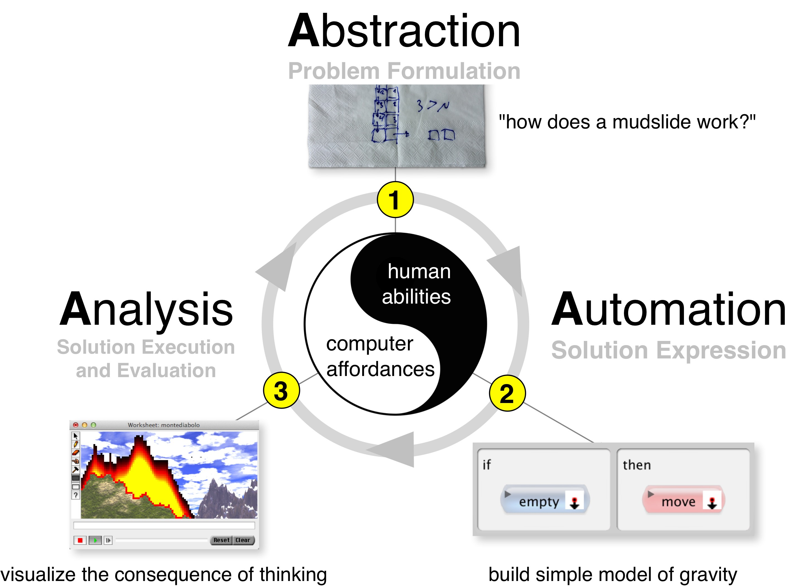
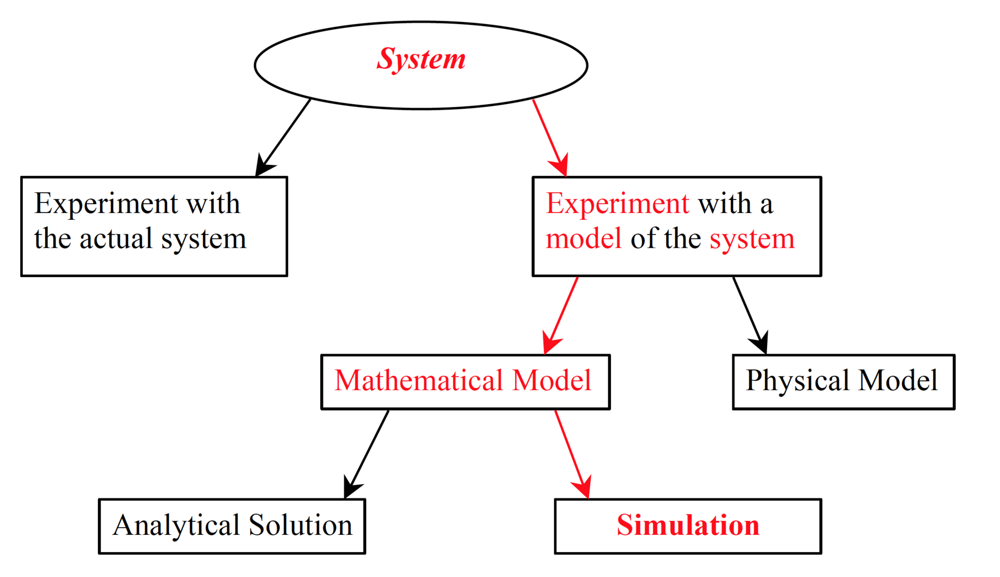

# 科学计算
---
[计算科学](https://en.wikipedia.org/wiki/Computational_science)，也被称为**科学计算**或**科学计算**（SC），是数学和[计算机科学](https://en.wikipedia.org/wiki/Computer_science)的一个领域，即利用先进的计算能力来理解和解决复杂问题。它是一个跨越许多学科的科学领域，但在其核心在于开发模型和模拟方法用于理解自然系统。

* 算法（数值方法和非数值方法）：为解决科学（如生物、物理和社会）、工程和人文问题而开发的数学模型、计算模型和计算机模拟。
* 计算机硬件：开发和优化解决高计算量问题所需的先进硬件、软件、网络和数据管理系统。
* 计算基础设施：帮助解决科学和工程问题，和推动计算机和信息科学发展。

在实际应用中，它通常是应用[计算机模拟](https://en.wikipedia.org/wiki/Computer_simulation)和其他来自**数值分析**和**理论计算机科学**的计算形式来解决各科学学科的问题。科学计算与理论或者实验室实验不同，后者是科学和工程的传统研究范式。科学计算则是通过分析在计算机上运行的数学模型来获得对特定问题的理解。科学家和工程师开发计算机程序和应用软件，对所研究的系统进行建模，并以各种输入参数集运行这些程序。计算科学的本质是数值算法和计算数学的应用。在某些情况下，这些模型需要大量的计算（通常是高精度浮点计算），并经常在超级计算机或分布式计算平台上执行。数值分析是运算科学中使用的技法的重要基础。 

上图中左图为苯的最低未占分子轨道；右图为X-43A试验机于7马赫速度时的运算流体力学（CFD）等值线图。

## 计算思维
---
[计算思维](https://en.wikipedia.org/wiki/Computational_thinking)是起源于理论计算科学中的概念，原指构造性的逻辑思维。它被用来描述人类面对复杂问题时，采取类似计算机系统的抽象、分解、转化和计算的思维过程。

## 计算科学家
---
计算科学家这一术语被用来描述在自身研究领域中使用科学计算的人。这样的人通常是一位科学家、工程师或应用数学家，他们以不同的方式应用高性能计算来推动各自的物理、化学或工程等应用学科的尖端研究。

科学计算现在通常被认为是科学研究的第三种范式，是对实验/观察和理论的补充和增补。在这里，人们把一个系统定义为数据的潜在来源，实验是通过系统的输入施加数据而从系统中提取数据的过程，系统(*S*)的模型*(M*)和实验(*E*)是任何可以应用*E*来回答关于*S*的问题的东西。 一个计算科学家应该有能力：

* 识别复杂的问题
* 将包含这些问题的系统充分地概念化
* 设计一个适合研究这个系统的算法框架：模拟
* 选择一个合适的计算基础设施（并行计算/网格计算/超级计算机）
* 最大限度地提高模拟的计算能力
* 评估模拟的输出在多大程度上与系统相似：验证模型
* 对系统的概念化进行相应的调整
* 重复这一循环，直到获得适当的验证水平：计算科学家相信，模拟可以产生充分接近现实的系统结果。

科学哲学家们探讨了计算科学在多大程度上符合科学的条件。汉弗莱斯和格尔法特探讨了认识论的一般问题：如何从这种计算科学方法中获得洞察力？托克用这些见解来说明基于计算机的模拟研究的认识论限制。由于计算科学使用的是以可执行形式表示基础理论的数学模型，从本质上讲，它们应用了建模(理论构建)和模拟(实施和执行)。虽然模拟和计算科学是我们表达知识和理解的最复杂的方式，但它们也伴随着所有已经知道的计算解决方案的约束和限制。

## 科学计算的应用
---

### 计算流体力学
计算流体力学（CFD）是流体力学的一个分支，使用数值分析和数据结构来分析和解决涉及流体流动的问题。计算机被用来执行模拟流体自由流动所需的计算，以及流体（液体和气体）与边界条件定义的表面的相互作用。有了高速的超级计算机，可以实现更好的解决方案，而且往往需要解决最大和最复杂的问题。正在进行的研究产生了一些软件，这些软件提高了复杂模拟场景的准确性和速度，如跨音速或湍流。这类软件的最初验证通常是使用实验设备，如风洞进行的。此外，以前对某一特定问题进行的分析或经验分析也可用于比较。最后的验证通常使用全尺寸测试，如飞行测试。CFD被应用于许多研究领域和行业的广泛研究和工程问题，包括空气动力学和航空航天分析、高超音速、天气模拟、自然科学和环境工程、工业系统设计和分析、生物工程、流体流动和传热、发动机和燃烧分析以及电影和游戏的视觉效果。

### 计算金融学
在金融市场上，大量相互依赖的资产由不同地点和时区的大量市场参与者进行交易。它们的行为具有空前的复杂性，对这套高度多样化的工具所固有的风险的描述和测量通常是基于复杂的数学和计算模型。准确地以封闭形式解决这些模型，即使是在单一工具层面，通常也是不可能的，因此我们必须寻找有效的数字算法。最近，这个问题变得更加紧迫和复杂，因为信贷危机已经清楚地表明了从单个工具到单个机构的投资组合，甚至是相互关联的交易网络的级联效应的作用。理解这一点需要一种多尺度和整体的方法，在这种方法中，市场、信用和流动性风险等相互依存的风险因素被同时建模，并在不同的相互关联的尺度上进行建模。

### 计算生物学
生物技术令人振奋的新发展目前正在彻底改变生物学和生物医学研究。这些技术的例子包括高通量测序、高通量定量PCR、细胞内成像、基因表达的原位杂交、三维成像技术如光片荧光显微镜和光学投影（微）计算机断层扫描。鉴于这些技术所产生的大量复杂数据，它们的有意义的解释，甚至它们的存储，构成了需要新方法的主要挑战。超越目前的生物信息学方法，计算生物学需要开发新的方法来发现这些大数据集中有意义的模式。基于模型的基因网络重建可以用来系统地组织基因表达数据并指导未来的数据收集。这里的一个主要挑战是了解基因调控是如何控制生物矿化和胚胎发生等基本生物过程的。基因调控、与矿物沉积过程相互作用的有机分子、细胞过程、生理学以及组织和环境层面的其他过程等子过程是相互联系的。生物矿化和胚胎发生不是由中央控制机制指挥的，而是可以被看作是一个复杂系统产生的突发行为，在这个系统中，非常不同的时间和空间尺度（从纳米和纳秒到米和年）的几个子过程被连接成一个多尺度系统。

### 计算化学
计算化学是理论化学的一个分支，主要目的是利用有效的数学近似以及电脑程序计算分子的性质，例如总能量、偶极矩、四极矩、振动频率、反应活性等，并用以解释一些具体的化学问题。计算化学这个名词有时也用来表示计算机科学与化学的交叉学科。 理论化学泛指采用数学方法来表述化学问题，而计算化学作为理论化学的一个分支，常特指那些可以用电脑程序实现的数学方法。计算化学并不追求完美无缺或者分毫不差，因为只有很少的化学体系可以进行精确计算。不过，几乎所有种类的化学问题都可以并且已经采用近似的算法来表述。理论上讲，对任何分子都可以采用相当精确的理论方法进行计算。很多计算软件中也已经包括了这些精确的方法，但由于这些方法的计算量随电子数的增加成指数或更快的速度增长，所以他们只能应用于很小的分子。对更大的体系，往往需要采取其他一些更大程度近似的方法，以在计算量和结果的精确度之间寻求平衡。

第一性原理（*First Principal*）或者从头算法（*ab initio method*）在量子化学计算中指基于量子力学基本原理直接求解薛定谔方程的量子化学计算方法。从头计算法的特点是没有经验参数，并且对体系不作过多的简化。对各种不同的化学体系采用基本相同的方法进行计算。目前的从头计算法包括基于哈特里－福克方程的哈特里–福克方法、在哈特里–福克基础上引入电子相关作用校正而发展起来的后哈特里–福克方法，以及多组态多参考态方法等。与半经验方法相比，从头计算法精度高，但耗时长。 

### 机器学习
机器学习是人工智能的一个分支。人工智能的研究历史有着一条从以“推理”为重点，到以“知识”为重点，再到以“学习”为重点的自然、清晰的脉络。显然，机器学习是实现人工智能的一个途径，即以机器学习为手段解决人工智能中的问题。机器学习在近30多年已发展为一门多领域交叉学科，涉及概率论、统计学、逼近论、凸分析、计算复杂性理论等多门学科。机器学习理论主要是设计和分析一些让计算机可以自动“学习”的算法。机器学习算法是一类从数据中自动分析获得规律，并利用规律对未知数据进行预测的算法。因为学习算法中涉及了大量的统计学理论，机器学习与推断统计学联系尤为密切，也被称为统计学习理论。算法设计方面，机器学习理论关注可以实现的，行之有效的学习算法。很多推论问题属于无程序可循难度，所以部分的机器学习研究是开发容易处理的近似算法。机器学习已广泛应用于数据挖掘、计算机视觉、自然语言处理、生物特征识别、搜索引擎、医学诊断、检测信用卡欺诈、证券市场分析、DNA序列测序、语音和手写识别、战略游戏和机器人等领域。 

## 科学计算算法
---
### 计算机代数学
包括统计、方程求解、代数、微积分、几何、线性代数、张量分析（多线性代数）、优化等领域的符号计算。

### 数值分析
* 作为收敛和渐近级数的泰勒级数的应用
* 利用自动微分运算微分
* 利用有限差运算微分
* 图论集
* 凭借泰勒级数和理查森外推法进行高阶微分逼近
* 均匀网格上的积分方法：矩形法、梯形法、中点法和辛普森积分法
* 龙格－库塔法解常微分方程
* **蒙特卡洛方法**
* **分子动力学**
* **有限元方法**
* 数值线性代数
* 用高斯消元法运算LU因子
* 乔里斯基分解
* 离散傅里叶变换及应用
* 牛顿法
* 动力系统的时步法

程序设计语言普遍应用于科学运算应用中偏向数学的方面，包括R语言、MATLAB、Mathematica、Scilab、GNU Octave、COMSOL Multiphysics、SciPy的Python语言等。偏向于密集型运算的科学运算常会利用C语言或Fortran的一些变体以及BLAS或LAPACK等最优化代数库。

计算科学应用程序常常创建真实世界变化情况的模型，包括天气、飞机周围的气流、事故中的汽车车身变形、星系中恒星的运动、爆炸设备等。这类程序会在计算机内存中创建一个“逻辑网格”，网格中的每一项在空间上都对应一个区域，并包含与模型相关的那一空间的信息。例如在天气模型中，每一项都可以是一平方千米，并包含了地面海拔、当前风向、温度、压力等。程序会在模拟时步中基于当前状态运算出可能的下一状态，解出描述系统运转方式的方程，然后重复上述过程运算出下一状态。 

## 高性能计算
---

[高性能计算](https://en.wikipedia.org/wiki/High-performance_computing) (HPC) 是指通过聚合计算能力来提供比传统计算机和服务器更强大的计算性能。高性能计算 (HPC) 或超级计算和日常计算一样，区别只在于它的计算能力更强大。它能够通过聚合结构，使用多台计算机和存储设备，以极高速度处理大量数据，帮助人们探索科学、工程及商业领域中的一些世界级的重大难题。

* 大规模并行运算
* 高速网络互联
* 具备任务管理和作业调度系统
* 使用Linux操作系统
* 使用C或Fortran开发应用软件

上图为[江汉大学高性能计算系统](https://iir.jhun.edu.cn/4a/12/c1043a18962/page.htm)

### GPU计算
相比于CPU架构，在相同的面积上，GPU将更多的晶体管用于数值计算，取代了缓存(Cache)和流控（Flow Control），GPU的计算单元Core数量远多于CPU，但Cache和Control都要少。在相同晶体管数目下，GPU相对于CPU有更高的理论浮点性能。当前，最主流的GPU计算开发工具为[Nvidia](https://www.nvidia.cn/data-center/gpu-cloud-computing)的[CUDA](https://www.nvidia.cn/geforce/technologies/cuda/)。

### 量子计算
[量子计算](https://en.wikipedia.org/wiki/Quantum_computing)是一种遵循量子力学规律调控量子信息单元进行计算的新型计算模式。对照于传统的通用计算机，其理论模型是通用图灵机；通用的量子计算机，其理论模型是用量子力学规律重新诠释的通用图灵机。从可计算的问题来看，量子计算机只能解决传统计算机所能解决的问题，但是从计算的效率上，由于量子力学叠加性的存在，某些已知的量子算法在处理问题时速度要快于传统的通用计算机。

# Python
---

[低级语言](https://en.wikipedia.org/wiki/Low-level_programming_language)和[高级语言](https://en.wikipedia.org/wiki/Low-level_programming_language)的区别:

| High Level Language | Low Level Language |
|---|---|
| It is programmer friendly language. | It is a machine friendly language. |
| It runs slower. | It runs faster. |
| It is less memory efficient. | It is high memory efficient. |
| It is easy to understand. | It is tough to understand. |
| It is simple to maintain. | It is tough to understand. |
| It can run on any platform. | It is machine-dependent. |
| It needs compiler or interpreter for translation. | It needs assembler for translation. |
| It is used widely for programming. | It is not commonly used. |

Python是一种解释型、面向对象、动态数据类型的高级程序设计语言，被广泛地应用于科学计算和工程领域。作为一种通用性语言，Python并不是专为数值计算设计的(*不同于Fortran*)，但其很多特性使之非常适合于本课程。首先，Python因其简洁易读的代码语法而闻名。其次，Python拥有非常丰富的低级语言编写的库和软件包。因此，Python已经成为了一种非常流行的“胶水语言”。使用Python和科学计算库这样的高级编程语言环境，可以最大限度地缩短开发时间（而不是CPU运行时间）。

## Anazonda
---

[Anaconda](https://www.anaconda.com/)是一个开源的Python和R语言的发行版本，用于计算科学（数据科学、机器学习、大数据处理和预测分析），Anaconda致力于简化软件包管理系统和部署。Anaconda的包使用软件包管理系统Conda进行管理。在Windows环境下[安装](https://docs.anaconda.com/anaconda/install/windows/)配置也非常简单。

## Jupyter
---

Jupyter Notebook是一种基于Jupyter的交互式文档，支持文本、公式、数据可视化（图像动画等），以及原位执行的程序代码。Jupyter Notebook运行于网页浏览器中，可以提供丰富的互动式教学工具和体验。

### 免费计算资源
[Google Colab](https://colab.google.com)